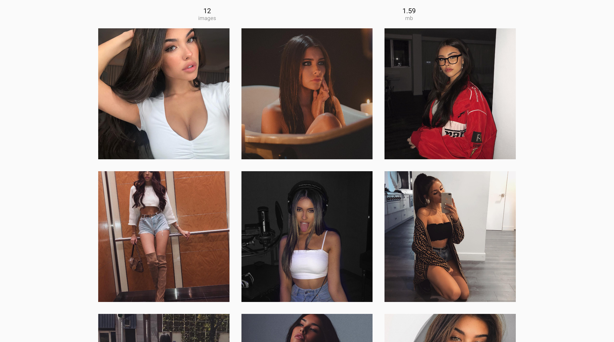

# Gallery Generator Theme

Simple instagram-like image gallery.

This theme was created for [Pygram](https://github.com/malcodeman/Pygram) - static gallery generator.

Aspect ratio problem was solved with viewport units.

## Assets

- [Lena Meyer-Landrut images](https://www.instagram.com/lenameyerlandrut)
- [Madison Beer images](https://www.instagram.com/madisonbeer)
- [Roboto font](https://fonts.google.com/specimen/Roboto)

## License

This project is licensed under the MIT License - see the [LICENSE](LICENSE) file for details.
